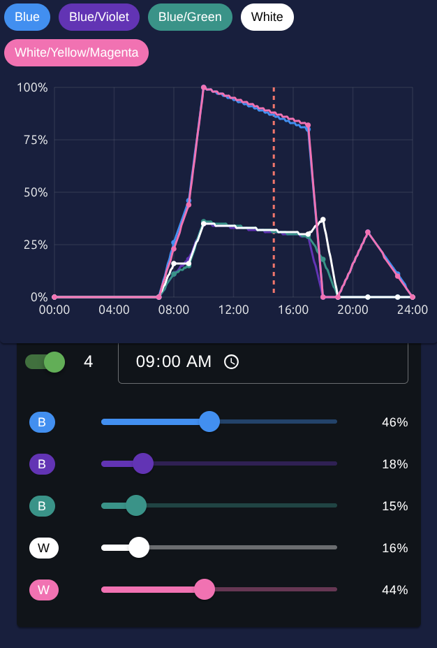

# Aquarium Lamp Frontend

A Vue.js web application for controlling an ESP32-based aquarium lamp with 5 LED channels (Blue, Blue/Violet, Blue/Green, White, White/Yellow/Magenta).

## Screenshot



## Features

- **Real-time Control**: Manual brightness control for each LED channel
- **Schedule Management**: Create and manage daily lighting schedules with up to 10 time points
- **WiFi Configuration**: Setup WiFi connection in AP or Client mode
- **Time Synchronization**: NTP time sync with timezone support
- **Device Management**: Monitor device status, memory usage, and uptime
- **Responsive Design**: Works on desktop and mobile devices

## Technology Stack

- **Frontend**: Vue 3 + TypeScript + Vuetify 3
- **State Management**: Pinia
- **Build Tool**: Vite
- **Styling**: Vuetify Material Design + Custom CSS

## Installation

1. Clone the repository:
   ```bash
   git clone <repository-url>
   cd AquariumLampFrontend
   ```

2. Install dependencies:
   ```bash
   npm install
   ```

3. Start development server:
   ```bash
   npm run dev
   ```

4. Build for production:
   ```bash
   npm run build
   ```

## API Integration

The application automatically detects the ESP32 IP address from the browser URL and makes API calls to the same host. No manual endpoint configuration required.

### Automatic API Endpoint Detection

- If UI is accessed at \`http://192.168.4.1:3000\` → API calls go to \`http://192.168.4.1\`
- If UI is accessed at \`http://192.168.1.100:8080\` → API calls go to \`http://192.168.1.100\`

## ESP32 API Specification

### Base URL
The API base URL is automatically determined from the current browser location.

### Authentication
Currently no authentication is required. All endpoints are publicly accessible.

### Content Type
All requests and responses use \`application/json\` content type.

---

## API Endpoints

### 🔧 Device API

#### Get Device Info
```http
GET /api/device/info
```
**Response:**
```json
{
    "connected": true,
    "name": "DeviceName",
    "ip": "192.168.1.100",
    "subnet": "255.255.255.0",
    "gateway": "192.168.1.1",
    "rssi": -45,
    "macAddress": "00:1A:2B:3C:4D:5E",
    "heapSize": 20480,
    "heapUsage": 75,
    "maxFreeBlockSize": 10240,
    "uptime": "1d 2h 3m",
    "time": "2025-08-26T12:00:00+00:00",
    "timezone": "UTC"
}
```

#### Reboot Device
```http
POST /api/device/reboot
```
**Response:**
```json
{
    "success": true
}
```

#### Factory Reset
```http
POST /api/device/factory_reset
```
**Response:**
```json
{
    "success": true
}
```

#### Update Device Time
```http
POST /api/device/time
Content-Type: application/json

{
    "date": "2025-08-26T12:00:00+00:00"
}
```
**Response:**
```json
{
    "success": true
}
```

### 📡 WiFi API

#### Scan WiFi Networks
```http
GET /api/wifi/scan
```
**Response:**
```json
{
    "scanning": false,
    "networks": [
        {
            "ssid": "HomeWiFi",
            "signal": -45,
            "secure": true
        },
        {
            "ssid": "GuestWiFi",
            "signal": -70,
            "secure": false
        }
    ]
}
```

#### Get WiFi Configuration
```http
GET /api/wifi/config
```
**Response:**
```json
{
    "ap": {
        "enabled": true,
        "ssid": "AquariumLamp",
        "password": "12345678",
        "ip": "192.168.4.1",
        "gateway": "0.0.0.0",
        "subnet": "0.0.0.0"
    },
    "sta": [
        {
            "enabled": false,
            "ssid": "",
            "password": "",
            "hostname": "",
            "ip": "0.0.0.0",
            "gateway": "0.0.0.0",
            "subnet": "0.0.0.0",
            "dns1": "0.0.0.0",
            "dns2": "0.0.0.0",
            "dhcp": true,
            "autoDns": true
        }
    ]
}
```

#### Update WiFi Configuration
```http
POST /api/wifi/config
Content-Type: application/json

{
    "ap": {
        "enabled": true,
        "ssid": "AquariumLamp",
        "password": "12345678"
    }
}
```
**Response:**
```json
{
    "success": true
}
```

### 🔌 OneWire Device API

#### Scan OneWire Devices
```http
GET /api/one_wire_device/scan
```
**Response:**
```json
{
    "inProgress": false,
    "devices": [
        "28:FF:0C:2A:04:00:00:1C",
        "28:FF:1D:3B:05:00:00:2D"
    ]
}
```

#### Start Scanning OneWire Devices
```http
POST /api/one_wire_device/scan
```
**Response:**
```json
{
    "success": true
}
```

### 💡 Lamp API

#### Get Lamp State
```http
GET /api/lamp/state
```
**Response:**
```json
{
    "mode": "scheduled",
    "manualBrightness": [0, 0, 0, 0, 0],
    "schedules": [
        {
            "enabled": true,
            "from": "06:00",
            "brightness": [100, 80, 60, 90, 70]
        },
        {
            "enabled": false,
            "from": "18:00",
            "brightness": [0, 0, 0, 0, 0]
        }
    ]
}
```

#### Set Lamp Mode
```http
POST /api/lamp/mode
Content-Type: application/json

{
    "mode": "manual"
}
```
**Parameters:**
- `mode`: Specifies the operational mode of the lamp. Possible values are:
  - `scheduled`: The lamp operates based on a predefined schedule.
  - `manual`: The lamp operates with manually set brightness levels.

**Response:**
```json
{
    "success": true
}
```

#### Update Lamp Schedules
```http
POST /api/lamp/schedules
Content-Type: application/json

{
    "schedules": [
        {
            "enabled": true,
            "from": "06:00",
            "brightness": [100, 80, 60, 90, 70]
        },
        {
            "enabled": false,
            "from": "18:00",
            "brightness": [0, 0, 0, 0, 0]
        }
    ]
}
```
**Response:**
```json
{
    "success": true
}
```

#### Update Channel Brightness
```http
POST /api/lamp/brightness
Content-Type: application/json

{
    "channel": 0,
    "brightness": 75
}
```
**Response:**
```json
{
    "success": true
}
```

### 🌡️ Temperature Sensor API

#### Get Temperature Sensor Configuration
```http
GET /api/temp/config
```
**Response:**
```json
{
    "address": "01:02:03:04:05:06:07:08",
    "exp_filter_wight": 1,
    "approx_factor": 1,
    "approx_offset": 0
}
```

#### Update Temperature Sensor Configuration
```http
POST /api/temp/config
Content-Type: application/json

{
    "address": "01:02:03:04:05:06:07:08",
    "exp_filter_wight": 2,
    "approx_factor": 1.5,
    "approx_offset": 0.1
}
```
**Response:**
```json
{
    "success": true
}
```

### 🌬️ Fan State API

#### Get Fan State
```http
GET /api/fan/state
```
**Response:**
```json
{
    "mode": "auto"
}
```

#### Update Fan State
```http
POST /api/fan/state
Content-Type: application/json

{
    "mode": "on"
}
```
**Parameters:**
- `mode`: Specifies the operational mode of the fan. Possible values are:
  - `auto`: The fan operates automatically based on temperature or other conditions.
  - `on`: The fan is always on.
  - `off`: The fan is turned off.
  - `pause`: The fan is temporarily paused.

**Response:**
```json
{
    "success": true
}
```

### 🌡️ Cooling Manager API

#### Get Cooling Manager Configuration
```http
GET /api/fan/cooling_manager/config
```
**Response:**
```json
{
    "temperature": 25,
    "hysteresis": 2
}
```

#### Update Cooling Manager Configuration
```http
POST /api/fan/cooling_manager/config
Content-Type: application/json

{
    "temperature": 26,
    "hysteresis": 1.5
}
```
**Response:**
```json
{
    "success": true
}
```

---

## Error Handling

All API endpoints should return appropriate HTTP status codes:

- \`200\` - Success
- \`400\` - Bad Request (invalid parameters)
- \`404\` - Not Found (invalid endpoint)
- \`500\` - Internal Server Error

**Error Response Format:**
```json
{
    "success": false,
    "error": "Error message description",
    "code": "ERROR_CODE"
}
```

## LED Channel Mapping

| Channel | Color | Description |
|---------|-------|-------------|
| 0 | Blue | Pure blue LEDs |
| 1 | Blue/Violet | Blue-violet spectrum |
| 2 | Blue/Green | Cyan/teal spectrum |
| 3 | White | Cool white LEDs |
| 4 | White/Yellow/Magenta | Warm white/full spectrum |

## Development Notes

### Auto-refresh
The application automatically refreshes lamp data and device info every 5 seconds (configurable).

### Offline Mode
If the ESP32 is unreachable, the app continues to work with cached data and shows connection status.

### Optimistic Updates
UI updates immediately when user makes changes, then syncs with the device. If sync fails, changes are reverted.

## Browser Compatibility

- Chrome 90+
- Firefox 88+
- Safari 14+
- Edge 90+

## License

This project is licensed under the GNU General Public License v3.0. See the [LICENSE](LICENSE) file for details.
